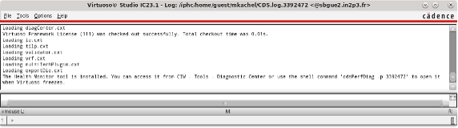

# Setup

To launch the lab you need to setup the environement

## PDK Installation

Install the PDK.

```sh
cd pdk
./install.sh
cd ..
```

## Tools setup

Setup the tools.

```sh
cd scripts
source tools_setup.sh
```

## Project creation

Create the project call `lab01` in the `lab` directory.

```sh
./new_project.sh -n lab01 -d ../lab
```

## Finalize the setup

Finalize the setup

```sh
cd ../lab/lab01
source pdk_setup.sh
```

## Library creation

Untar the `MAPS_academy_helper` library in the project directory.

```sh
tar xzvf ../materials/MAPS_academy_helper.tar.gz
```

Add the library in the library definition file (cds.lib)

```sh
echo "DEFINE MAPS_academy_helper MAPS_academy_helper" >> cds.lib
```

## Launch virtuoso

To Launch virtuoso.

```sh
virtuoso &
```

If everything is going well you will see the `CIW` (Command Interpreter window)


