# Ideal Operational Amplifier (OpAMP)

## Library creation

Open the `Library Manager` from the `CIW` window:

!!! menu "Tools->Libray Manager..."

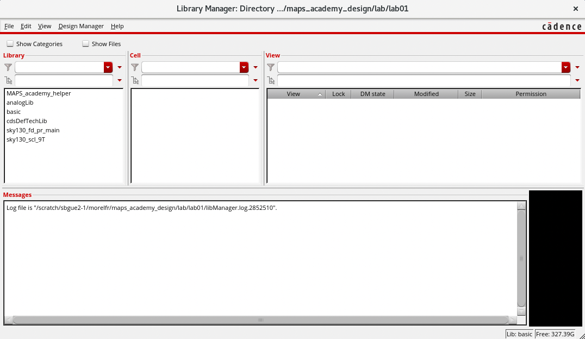

Create the library from the `Library Manager` window:

!!! menu "File->New->Library..."

In the `New Library` window, in the `Name` field put `MAPS_academy_lab`. Check that you are in the `lab/lab01` directory. Then click `OK`.

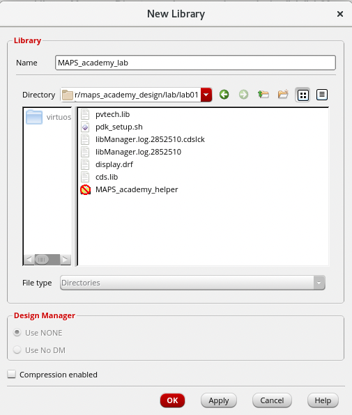

A new window appears to select the technology library. Select `Reference existing technology libraries`.

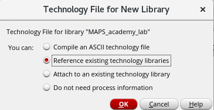

Then select the `sky130_fd_pr_main` an put it the `Reference Technology Libraries`column. Click `OK`

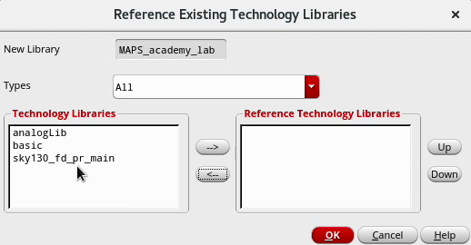

## Schematic creation

From Library Manager, select the library: `MAPS_academy_lab`.

Create the schematic view of `step1_idealOpAMP` cell.

!!! menu "File->New->Cell View..."

!!! info "Views"
    The cells are composed of different views. For the current tutorial we will focus on the following views:

    | View name   | Purpose                                             |
    |-------------|-----------------------------------------------------|
    | `schematic` | Schematic of the electrical circuit of the cell     |
    | `symbol`    | Symbol used in schematic for hierarchical designs   |
    | `layout`    | Physical representation of the cell                 |
    | `maestro`   | Setup of the simulations                            |

In the `New File` window fill the field `Cell` with `step1_idealOpAMP` and select `Type` as schematic (if not select by default). The field `View` is changing automatically with the selection of `Type`. Press `OK` to genearte the new schematic.

!!! warning "View Name"
    It is possible to change the name of the view, but not recommanded since it breaks the flow.

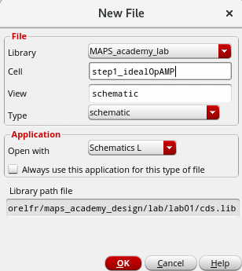

An empty schematic window appears.

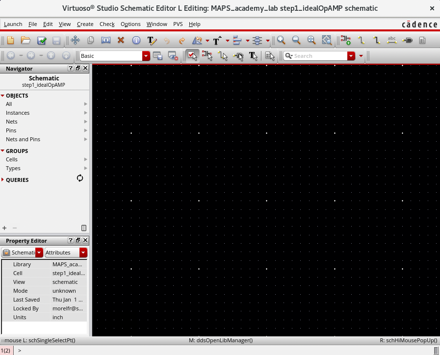

!!! info "Schematic and layout navigation"
    To navigate in the schematic and layout views use the keyboard arrows to move the design left, right, up and down. Use the mouse scroll wheel to zoom-in and out.

## Schematic drawing

Your goal in this step is to reproduce the following schematic:

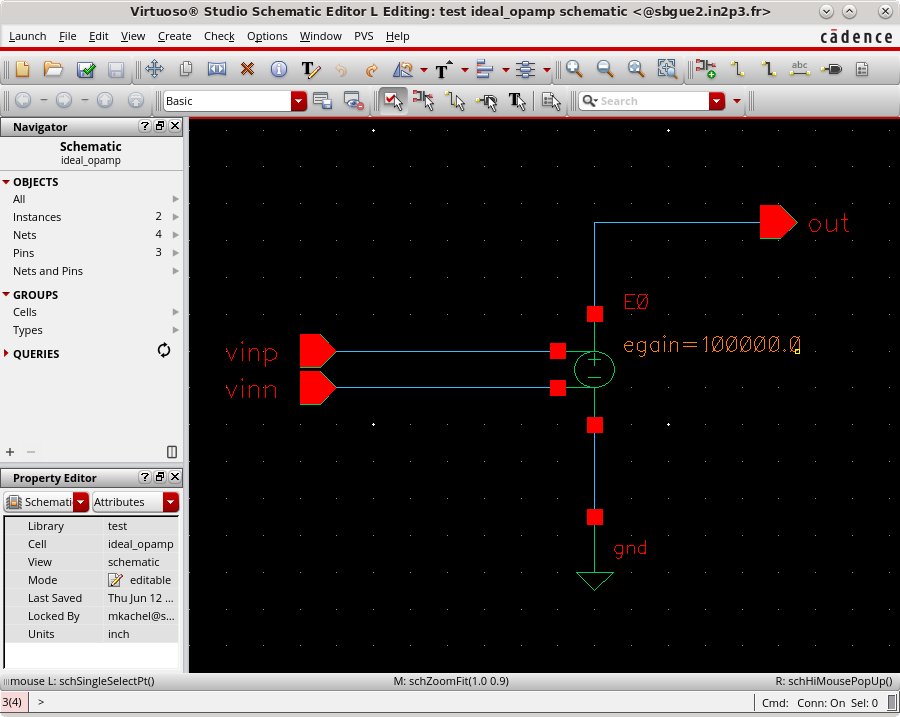

### Add pins

First you need the pins of the amplifier. Two inputs `Vin_p`and `Vin_n`and one output `Out`.

From the menu of the `Virtuoso Studio Schematic Editor` window.

!!! menu "Create->Pin"
    ++p++

This will open the `Create Pin` pop-up window.

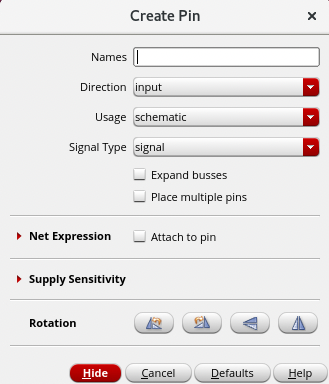

!!! info "Pop-up window"
    If the pop-up window didn't appear press the ++f3++ key. The ++f3++ key is used to show or hide the current action pop-up window in `Virtuoso Studio`

Check that `Direction` is set to `input`. Add in the `Names`field `Vin_p Vin_n`with a ++space++ between the two names. Go back to the `Virtuoso Studio Schematic Editor` window, while hovering your mouse over the schematic you can see a yellow symbol of the input pin `Vin_p`. Move the mouse to the middle of the schematic and press the ++left-button++ to place the first pin which turn in red. Now, the yellow symbol switch to the second pin. Place the second pin as the first one.

Operates the same way for the output pin, but remember to switch the `Direction`to `Output`.

You should have a schematic similar than this one.

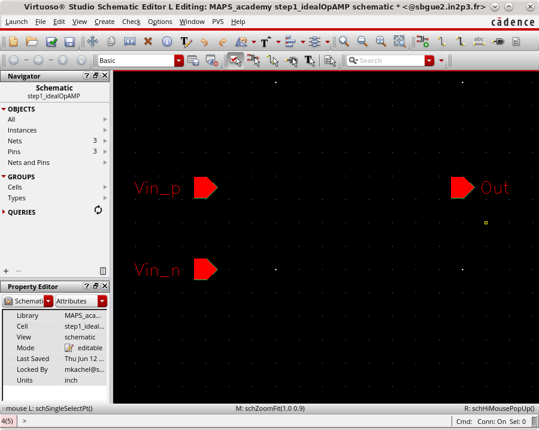

!!! info "Quit active command"
    To quit a active command in `Virtuoso Studio` press ++escape++ key.

### Add instance

Now you will add the core of the ideal operational amplifier, a voltage controlled voltage source (vcvs).

From the menu of the `Virtuoso Studio Schematic Editor` window.

!!! menu "Create->Instance"
    ++i++

This will open the `Add Instance` pop-up window.

Press the Browse button. In the `Library Browser` window select:

| Field    | Value      |
|----------|------------|
| Library  | analogLib  |
| Cell     | vcvs       |
| View     | symbol     |

Close the `Library Browser` window.

You should be left with the Add Instance dialog box similar to this one:

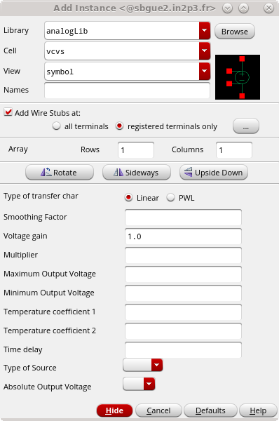

Put 1000000 (one million) for the `Voltage gain`, set also `Maximum Output Voltage` to 1.8 and `Minimum Output Voltage` to -1.8.

Press Enter to close the window. Now you’re back to your schematic. While hovering your mouse over the schematic you can see a yellow symbol of a `vcvs`. Move the mouse to the middle of the schematic and press the left mouse button to place the `vcvs`, then press ++escape++ key.

We also need to add the ground symbol to the schematic. Follow the steps like before and choose:

| Field    | Value      |
|----------|------------|
| Library  | analogLib  |
| Cell     | gnd        |
| View     | symbol     |

Place the `gnd` symbol directly below the `vcvs`.

### Add wire

Now connect the input and output pins to the `vcvs` symbol.

From the menu `Virtuoso Studio Schematic Editor` window.

!!! menu "Create->Wire (Narrow)"
    ++w++

Click on the two points you want to connect, then a blue wire will appear.

??? tip "Ensure good wire connection"
    When the mouse is closed to a connectable object a yellow diamond shape appears. The connection will be made when a small yellow square is in the center of the diamond shape.

    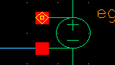

When done, `Check and Save` the design to see if there are no errors/warnings.

!!! menu "File->Check and Save"
    ++shift+x++

    

??? tip "Check and Save"
    The `Check and Save`command save the view but also check several rules (which could be modify to your needs) like: shorts, open, pin consistency across views, ...

    If there is errors or warnings, a pop-up window appears (errors have precedence over warnings). The information is also dispaly in the `CIW`. Markers are also added in the schematic view where the errors (white blinking markers) or warnings (yellow blinking markers) are.

    To list the errors or warnings:

    !!! menu "Check->Find Marker..."
        ++g++

    A pop-up window appears with the list of errors or warnings.

    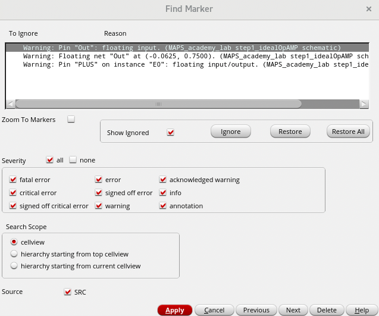

### Move objects
<!-- md:version 0.1.0 -->
<!-- md:extension [attr_list][Move objects] -->

??? tip "Move objects"

    There is two mode to move objetcs (instance, pin, wire, ...) in the `Virtuoso Studio Schematic Editor`: the `move`command and the `stretch`command. The `move` command move the object without keeping the connections made. The `stretch`command allow to move an object while keeping the connection and update the wire correspondidly.

    For the `move` command:
    !!! menu "Edit->Move"
        ++shift+m++

    For the `stretch` command:
    !!! menu "Edit->Stretch"
        ++m++

## Symbol creation

### Automatic creation

In order to reuse the created block, we will need to make a symbol that can be used in other designs. To do this, from the menu of the `Virtuoso Studio Schematic Editor` choose:

!!! menu "Create->CellView->From CellView..."

 This will open a `Cellview From Cellview` pop-up window. Make sure that the `Library Name` and `Cell Name` correspond to your schematic and that `To View Name` is set to `symbol`. Press `OK`.

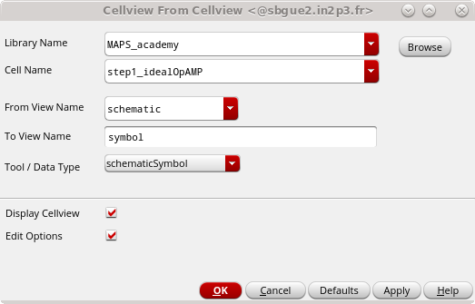

A next window will pop-up called `Symbol Generation Options`. Here you make sure that the `Vin_n` and `Vin_p` inputs are specified in the `Left Pins` field and `Out` is in the `Right Pins` field as in the following image.

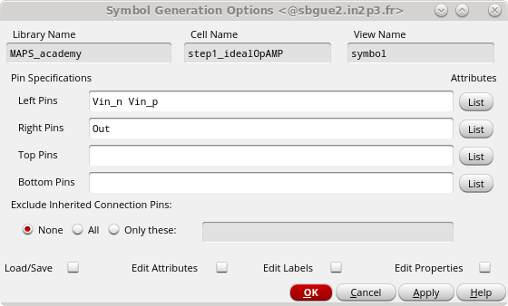

To generate the symbol using the analog standard: click on the `Load/Save` tick box, then in the `Load/Save Symbol Template Configuration` select `analog`in the drop-down list and click on `Load`. Press `OK` to create the symbol.

A `Overwrite Base Cell CDF` pop-up window appears, then press `Yes`

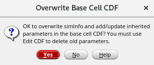

### Update the symbol

An automatically generated rectangular symbol of our schematic appears.

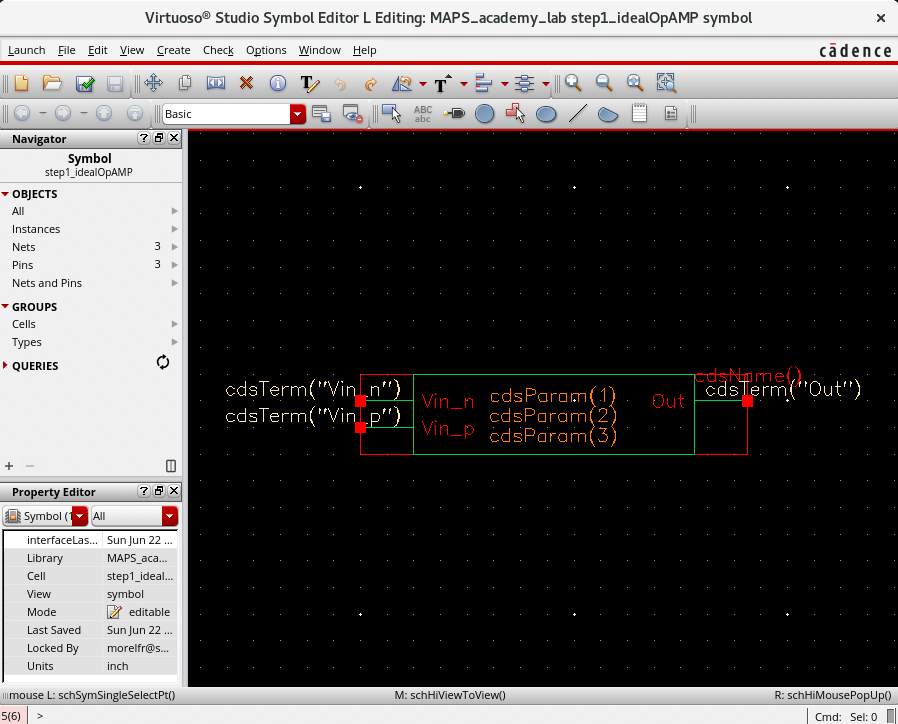

Since we are designing a Operational Amplifier, we can draw a correct symbol for it.

++left-button++ click on the green rectangle and suppress it.

!!! menu "Edit->Delete"
    ++del++

Now from the menu select:

!!! menu "Create->Shape->Line"

Draw a triangle.

Select the `Vin_p` and `Vin_n`pins by ++left-button++ clicking and dragging operation.

Adjust the red rectangle to surrond the symbol (keep-out box). You can use commands to [Move objects](#move-objects).

You will obtain the following symbol:

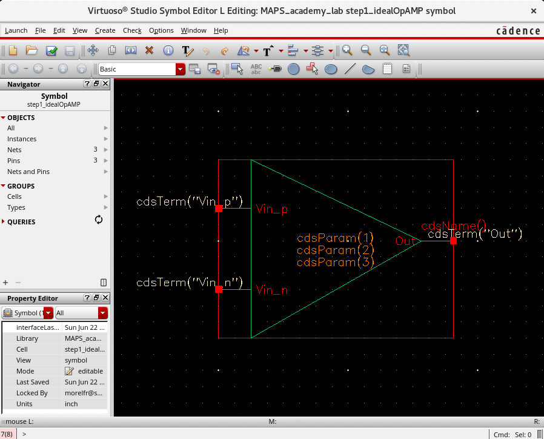

When the drawing is done, press `Check and Save` button to save the changes. You can close the `Virtuoso Studio symbol` window now.

## Test bench schematic creation

In order to check our design, we will create a higher-level schematic.

Go to the `Library Manager`, select the library `MAPS_academy_lab`.

Create a new cellview from the `Library Manager`
!!! menu "File->New Cellview"

In the `New File` window fill the field `Cell` with `tb_step1_idealOpAMP` and select `Type` as schematic (if not select by default). The field `View` is changing automatically with the selection of `Type`. Press `OK` to generate the new schematic.

Add our ideal op amp symbol to the design in the `tb_step1_idealOpAMP` schematic.

!!! menu "Create->Instance"
    ++i++

Make sure to select the right instance:

| Field    | Value              |
|----------|--------------------|
| Library  | MAPS_academy_lab   |
| Cell     | step1_idealOpAMP   |
| View     | symbol             |

From the menu of the `Virtuoso Studio Schematic Editor` window.

!!! menu "Create->Pin"
    ++p++

This will open the `Create Pin` pop-up window. Check that `Direction` is set to `output`. Add in the `Names`field `Out`. Place the pin at the schematic (on the right side of the idealOpAMP).

Let’s check if our idealOpAMP does its job.

From `analogLib` library add a DC voltage source (Cell is `vdc`) and a `gnd` symbol to the schematic.

Select the `vdc` source to copy it:

!!! menu "Edit->Copy"
    ++c++

Do the same for the `gnd` symbol. Then place and connect elements as in the following schematic:

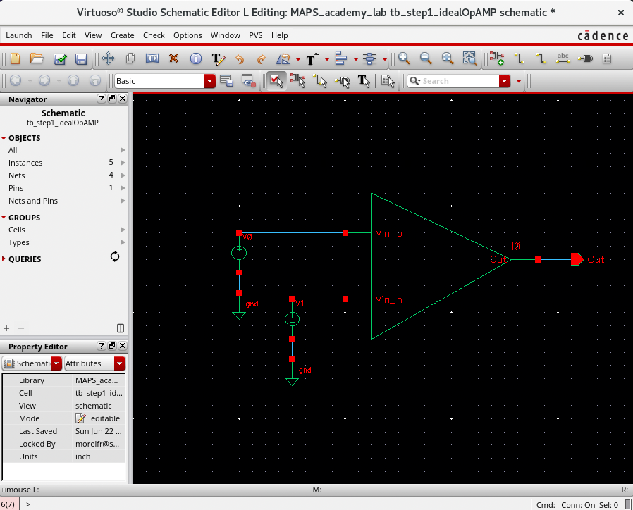

Now let’s change the value of the voltage connected to `Vin_n` pin. Select the `vdc` source connected to the `Vin_n` pin:

!!! menu "Edit->Properties->Objects"
    ++q++

A following window should appear.

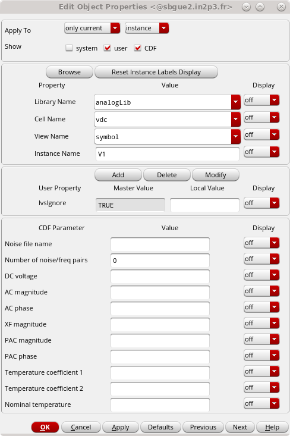

In the `DC voltage` field put a value higher than 0 and lower than 1.8 (for example 0.9), we will call this voltage a switching voltage. We don’t set the `vdc` source which is connected to the `Vin_p` pin as we will sweep it in the simulation.

Last modification is naming of the net.

!!! menu "Create->Wire Name"
    ++l++

Put the name for the input node, for example `in`. Select the wire going to the `Vin_p` pin to rename it to `in`.

Press `Check and Save`.

## Simulation

Still in the `Virtuoso Studio Schematic Editor`, go to the menu:

!!! menu "Launch-> ADE Explorer"

A pop-up window should appear. Select `Create New View` radio button.

The next pop-up window will be filled-in automatically, so we can just press `OK`. This will open `Virtuoso ADE Explorer`.

It’s an environment where we will perform simulations.

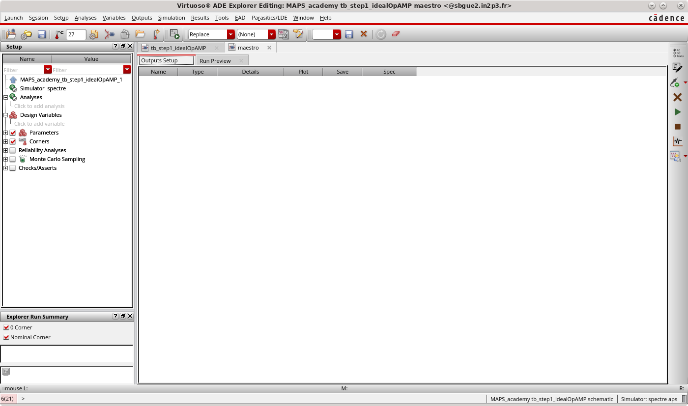

In the setup pane on the left side, we will add our analysis, by clicking the gray-out field `Click to add analysis` under the `Analysis` entry.

If you close the setup pane by accident go to:

!!! menu "Window->Assistants->Setup"

A pop-up window `Choosing Analyses` will appear:

- Choose the `dc` and in the `Sweep Variable` section click `Component parameter`.
- The pop-up will rearrange itself, you can click on the `Select Component` button and choose the DC source connected to the `Vin_p` pin.

    - Another pop-up will appear with all the parameters we can select for this element.
    - From this window we will choose first position which is: `dc` `vdc` `"DC voltage"`.
    - Click `OK` and go back to the `Choosing Analyses` window.

- In the `Sweep Range` section put the `Start` to 0 and `Stop` to 1.8. This will sweep the voltage from 0V to 1.8V at the `Vin_p` input of our ideal opAMP.
- Press `OK` (or ++enter++) to close the `Choosing analyses` window.

Go back to the `Virtuoso ADE Explorer` window by clicking on the `maestro` tab. We will select what voltages we are going to observe in this simulation.

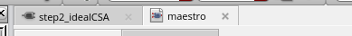

From the menu choose:

!!! menu "Outputs->To be plotted->Select on Design"

This will bring you to your schematic. Select input wire (going to the `Vin_p`) and output pin (or wire).

Press ++esc++ and go back to the `maestro` tab.

When back in the `Virtuoso ADE Explorer` by clicking on the `maestro`tab. Run the simulation:

!!! menu "Simulation->Netlist and Run"
    Or click the button from the tab on the right side.

    

    If the tab is closed by accident you can open it back by 
    
    !!! menu "Window->Toolbars->Run"

The simulation will be started, once done a `VIVA Graph`pane will appear on the right side of the main `ADE Explorer` window with our results.

You can be surprised that the value at which your comparator switches is not exactly equal to your switching voltage. This is because the simulator has chosen the step size automatically.

Go back to the Setup pane on the left side of the `ADE Explorer` and double click on the `dc` `Analysis`. You can confirm that the Sweep Type is set to Automatic. Change it to Linear and set the Step Size to 0.1m (so 100 µV).

Press `OK` and re-run the simulation.

You can see now that your comparator will cross at the voltage around what you’ve selected with precision of 100 µV.

**Excelent job! You have designed your (first?) comparator and it’s working.**

Close all the schematic and `ADE Explorer` windows. You can save changes if you want to.
