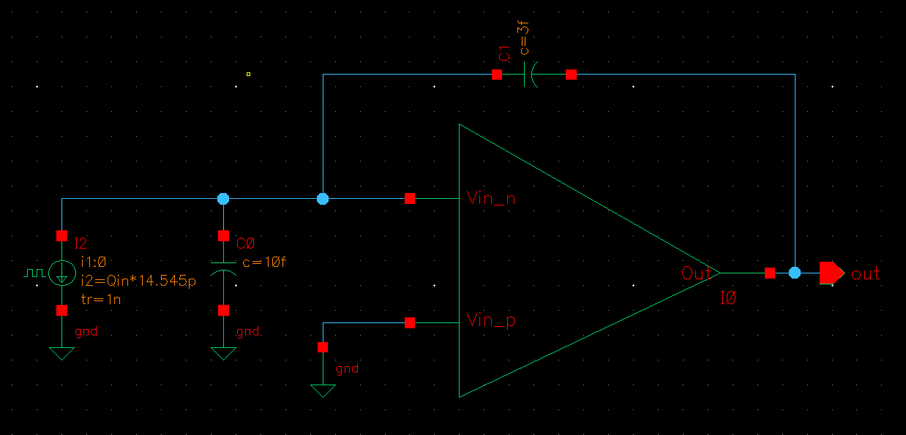
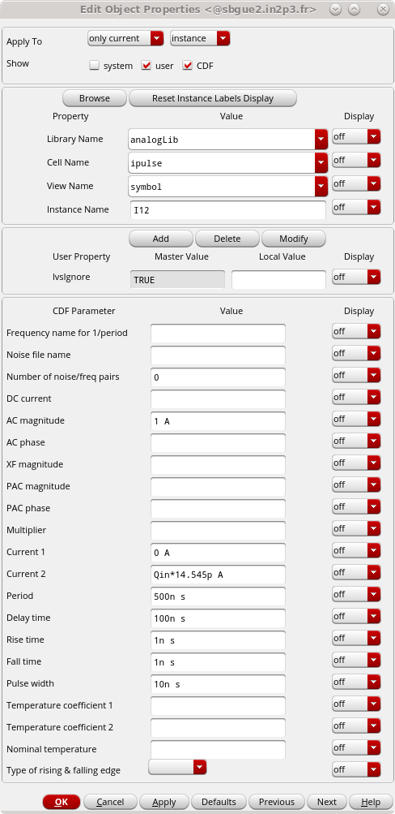

# Lab 03: Ideal Charge Sensitive Amplifier (CSA)

---
## Schematic

In the **Library Manager** window, create a new schematic:

| Library             | Cell              | View      |
|---------------------|-------------------|-----------|
| MAPS_academy_lab    | step2_tb_idealCSA | schematic |

While adding the `step1_idealOpAMP` symbol, in the **Add Instance** pop-up, press the **Upside Down** button to flip the symbol horizontally so that the negative pin is on top. Place the symbol back on the schematic.

To recreate the rest of the ideal CSA schematic as shown above, add the following components:

- Two capacitors:

  | Library    | Cell | View   |
  |------------|------|--------|
  | analogLib  | cap  | symbol |

- A pulsed current source:

  | Library    | Cell   | View   |
  |------------|--------|--------|
  | analogLib  | ipulse | symbol |

You also need the output pin `out` and the `gnd` symbol.

Set the capacitance values as follows: input `Cd = 10 fF`, feedback `Cf = 3 fF`.

To change the values, select the capacitance by clicking on it with the ++left-button++.

!!! menu "Edit->Properties->Objects"
    ++q++

The input current source should have the following parameters, as shown in the figure below:

---
## Test Bench

Now, let’s create the `maestro` view for this test bench:

!!! menu "Launch->ADE Explorer"

A pop-up window should appear. Select **Create New View**.

The next pop-up window will be filled in automatically, so simply press **OK**.

You can switch between the schematic and **ADE Explorer** by selecting the different tabs.

Add the analysis to the test bench by clicking on **Click to add analysis** in the **Setup** panel on the left side of **Virtuoso ADE Explorer**.

This time, select the `tran` analysis, which will show the behavior of the circuit over time.

Set the `Stop Time` to `20u` (which is 20 µs) and press ++enter++.

Add a design variable `Qin`, which represents the input charge (in electrons) generated by the input current source.

In the **Setup** pane of **ADE Explorer**, right-click on **Design Variables** and choose **Copy From Cellview**. This will add `Qin` to the **Design Variables** list.

Double-click on the right side of `Qin` to change its value to `1000`.

Now, select the voltage to observe:

!!! menu "Outputs->To be Plotted->Select On Design"

Select the `out` pin.

---
## Simulation

Go back to **Virtuoso ADE Explorer** (`maestro` tab) and run the simulation:

!!! menu "Simulation->Netlist and Run"
    Or click the button from the tab on the right side.

    

    If the tab is closed by accident, you can reopen it using:
    
    !!! menu "Window->Toolbars->Run"

When the simulation is complete, you should see that the CSA is integrating, increasing the voltage with each current pulse. This occurs because there is no reset mechanism for the feedback resistor.

This ideal CSA can handle both polarities of the input charge.

Change the `Qin` parameter in **ADE Explorer** from `1000` to `-1000` and restart the simulation to observe the effect.
