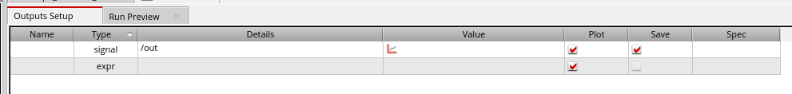
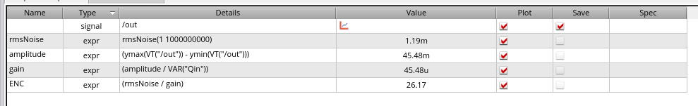
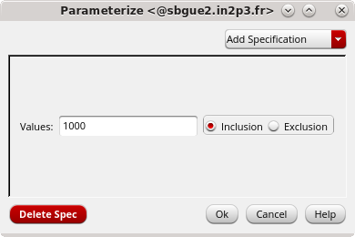
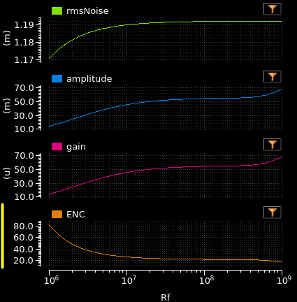

# Lab 04: Ideal CSA with Feedback Resistor

---
## Schematic

For this step, reuse the design of `step2_idealCSA`.

Open the schematic of `step2_idealCSA`:

!!! menu "File->Save a Copy..."
    ++ctrl+s++

In the pop-up window that appears, enter the new **Cell Name** as `step3_idealCSA_Rf` and press **OK**.

Close the `step2_idealCSA` schematic and open the newly created `step3_idealCSA_Rf`.

---
### Add Feedback Resistor

Add a feedback resistor to the schematic by pressing the ++i++ shortcut.

   Parameter   | Value         |
 |-------------|---------------|
 | Library     | `analogLib`   |
 | Cell        | `res`         |
 | View        | `symbol`      |

In the **Add Instance** pop-up window, set the **Resistance** value to `Rf`. This will be our second parameter.

While hovering over the schematic, the resistor appears in yellow. At this point, you can click the ++middle-button++ to rotate it 90°.

Rotate the resistor and place it in parallel with the feedback capacitor of the CSA. Make the connections.

!!! menu "Create->Wire (Narrow)"
    ++w++

---
### Modify Current Source Period

You can also change the repetition rate of the `ipulse` source.

Select the input current source and press ++q++.

Set the **Period** field to `5u`.

Confirm by clicking **OK** (or press ++enter++).

Complete the modifications by performing a **Check and Save**.

---
## Test Bench

---
### Transient Simulation

Navigate to:

!!! menu "Launch->ADE Explorer"

A pop-up window should appear. Select **Create New View**. The next pop-up window will be filled in automatically, so simply press **OK**.

In **Virtuoso ADE Explorer**, add a 20 µs transient analysis and copy the **Design Variables** from the **CellView**.

Set `Qin` to `1000` and `Rf` to `10M`.

Select the output of the CSA to plot:

!!! menu "Outputs->To be Plotted->Select On Design"

Finally, **run** the simulation.

You can now see that the feedback resistor resets the feedback capacitor, and the voltage returns to its initial value after each current pulse.

---
### Gain and Noise

Calculate the gain and noise of this solution.

To do this, add another analysis. In the **Setup** pane of **ADE Explorer**, click **Add Analysis** and choose **Noise**.

In the **Sweep Range** section, set **Start** to `1` and **Stop** to `1G`.

In the **Output Noise** section, change **Probe** to `Voltage`.

Set **Positive Output Node** to `out` (select → `out`).
Set **Negative Output Node** to `gnd!`.

For the input noise, change **Port** to `Current` and click **Select** to choose the input current source on the schematic.

After selecting the input current source, return to the **Choosing Analyses** window and press **OK**.

Return to the **maestro** tab.

Now that the analyses are configured, add the expressions to calculate the noise and gain automatically.

In **Virtuoso ADE Explorer**, go to the menu:

!!! menu "Outputs->Add->Expression"

This will add another entry to the **Outputs Setup** list in the middle of the screen.

Double-click in the **Name** field and enter: `rmsNoise`. Then in the **Details** field, enter: `rmsNoise(1 1G)`. This calculates the root mean square of the noise at the output node (selected in the noise analysis).

Add another expression to the **Outputs Setup** list. In the **Name** field, enter: `amplitude`. In the **Details** field, enter: `ymax(VT("/out")) - ymin(VT("/out"))`.

Ensure that `/out` corresponds to your output pin (case-sensitive). This calculates the difference between the maximum and minimum values of the `out` signal, providing an approximation of the amplitude.

Add two more expressions as shown in the following table:

 | Name   | Details                 |
 |--------|-------------------------|
 | gain   | amplitude / VAR("Qin")  |
 | ENC    | rmsNoise / gain         |

Run the simulation to test if the expressions work. The expression values should be displayed after the simulation finishes:

The **gain** is calculated in `[V/e-]` and **ENC** (Equivalent Noise Charge) is in `[e-]`.
Note that for the gain calculation, we used a `VAR("Qin")`, which is Virtuoso's way of referencing the `Qin` parameter declared in the **Design Variables** section.

If any of the calculated values display `eval err` in red, verify that the formulas in the **Details** fields are correct.

---
### Linearity

Now, perform a parametric simulation to observe the linearity of the CSA.

In the **Virtuoso ADE Explorer** main window, go to the **Setup** pane on the left side. In the **Design Variables** subsection, locate `Qin` (previously set to `1000`). Double-click on its value. A button with three dots will appear. Click it to open the **Parametrize** window.

Click **Delete Spec**, then **Add Specification**, and select **From/To**. Enter the following values:
- **From**: `100`
- **To**: `50k`
- **Total Steps**: `20`
Click **OK**.

Now, run your simulation. The simulator will perform 20 steps with the input charge ranging from `100 e-` to `50ke-`.

Once the simulation is complete, you will see `rmsNoise`, `amplitude`, `gain`, and `ENC` curves on the same plot.

Right-click on the plot and choose:

!!! rmb "Split Current Strip->Trace"

This allows you to view the expressions on separate plots.

Next to the expression plots, you should also see the **Transient Response** plot of the voltage at the `out` node for all 20 steps.

You can zoom in by right-clicking and dragging over the area. To return to the full view, press ++f++ on your keyboard. You can also zoom in/out by scrolling the mouse wheel while holding the ++shift++ key (horizontal zoom) or the ++ctrl++ key (vertical zoom).

---
### Feedback Resistor

Now, perform a simulation with different values of the feedback resistor `Rf`. Reset the `Qin` design variable to `1000` (by double-clicking the `Qin` formula and replacing it with `1000`).

Modify the `Rf` value as follows: double-click, select the **3-dots** button, and open the **Parametrize** window.

In the **From/To Sweep** section, change the **Step Type** from `Auto` to `Decade`. Enter the following values:

 | Parameter        | Value    |
 |------------------|----------|
 | `From`           | 1M       |
 | `To`             | 1G       |
 | `Steps/Decade`   | 10       |

Click **OK**.

Now, run your simulation. The simulator will perform 31 steps, varying the `Rf` values 10 times per decade.

Split the expression plot as before, and double-click `Rf` on the **X-axis**. This opens the **Independent Axis Properties** window, where you navigate to the **Scale** tab and enable **Log** in the **Scale Options**. Click **OK** to close the window. You should see plots similar to the following:

The **Transient Response** window shows that while a high `Rf` value is good for **ENC**, it will slow down your front-end and may cause pile-up problems.

You can change `Qin` to a different value and re-run the parametric simulation to observe the effects.

When finished, close the **Virtuoso ADE** window, saving any changes.