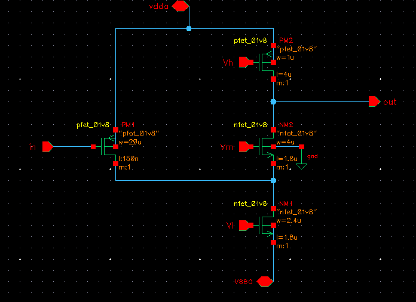
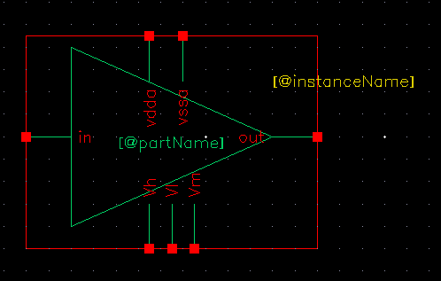
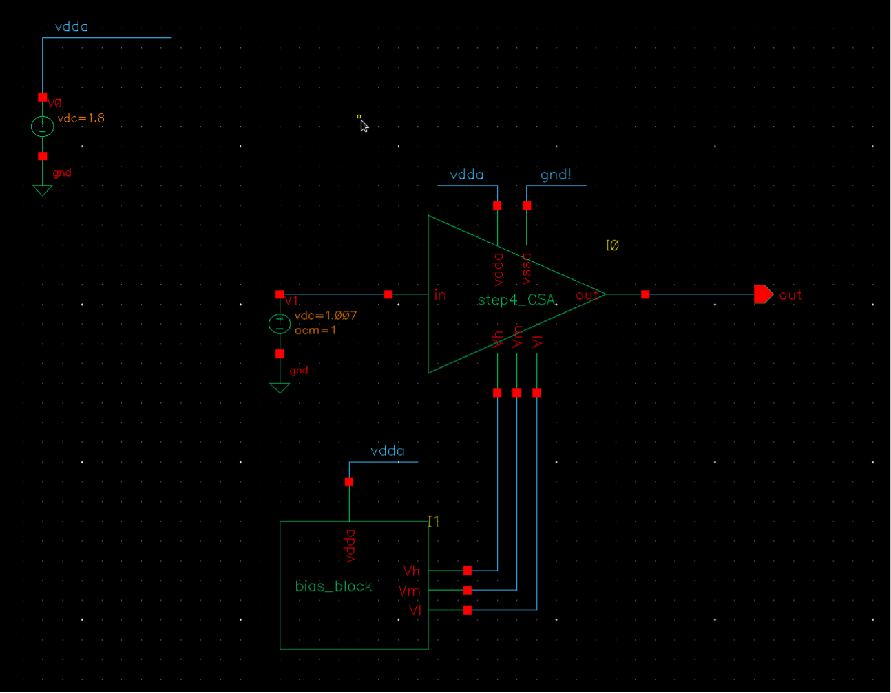
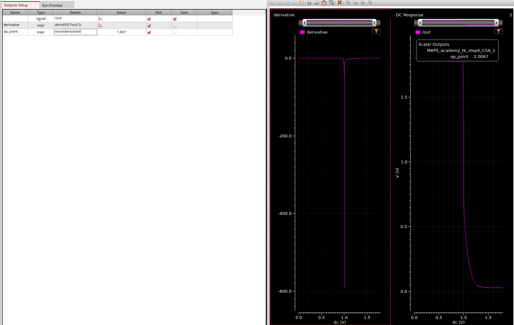

# Transistor design of a simple CSA Amplifier

## Schematic

In the Library Manager window create a new schematic.

| Library            | Cell        | View      |
|--------------------|-------------|-----------|
| MAPS_academy_lab   | step4_CSA   | schematic |

Open the newly created schematic. You will now reproduce the schematic given below:

The transistors can be found in the `sky130_fd_pr_main` library, their names are `nfet_01v8` and `pfet_01v8`. You’ll also need pins like in the table below:

| Pin Name | Direction    |
|----------|--------------|
| in       | Input        |
| Vl       | Input        |
| Vm       | Input        |
| Vh       | Input        |
| out      | Output       |
| vdda     | InputOutput  |
| vssa     | InputOutput  |

The transistor dimensions are given in the table below:

| Name | Length | Finger Width | Fingers |
|------|--------|--------------|---------|
| NM1  | 1.8u   | 2.4u         | 1       |
| NM2  | 1.8u   | 4u           | 1       |
| PM1  | 0.15u  | 5u           | 4       |
| PM2  | 4u     | 1u           | 1       |

Put a `net5` label on the node connecting the PM1 to NM1 ad NM2.

When your schematic is ready. Check for errors/warnings with a `Check and Save` button and create the symbol for your CSA.

!!! menu "Create->CellView->From CellView".

While creating the symbol put the reference voltages (Vl, Vm, Vh) in the `Bottom Pins` section.

The symbol design is up to you, however you can do it in the same way as the following figure:

## Test bench

Let’s add a testbench for our CSA. In the `Library Manager` window create a new schematic.

| Library           | Cell         | View      |
|-------------------|--------------|-----------|
| MAPS_academy_lab  | tb_step4_CSA | schematic |

Open the newly created schematic, and reproduce the following schematic:

To do this, you’ll need to place two `vdc` sources (from `analogLib`) an output pin and a `bias_block` that can be found in the `MAPS_academy_helper` library.

The `dc` source connected to the `vdda` should have the DC voltage set to 1.8, while the `vdc` source connected to the input port of the CSA should have the `AC` magnitude of 1, leave the DC voltage blank for now. We will now find the biasing conditions for this amplifier and calculate its gain.

Before going further do a `Check and Save` to be sure that your schematic is correct.

Create the maestro view to launch the simulations:

!!! menu "Launch->ADE Explorer->Create New View"

Press `OK` button in the prefilled `Create new ADE Explorer` view window. This brings you to the familiar window of the `Virtuoso ADE Explorer`.

First let’s to the DC analysis to find the best working conditions of our amplifier. (same step we already did with the ideal operational amplifier in [simulation](lab02.md#simulation)).

In the Setup pane on the left side add the DC analysis, by clicking the gray-out field `Click to add analysis`.

- In the pop-up window `Choose` the `dc` and in the `Sweep Variable` section click `Component parameter`.
- The pop-up will rearrange itself, you can click on the `Select Component` button and choose the DC source connected to the input of your CSA.

    - Another pop-up will appear with all the parameters we can select for this element.
    - From this window we will choose first position which is `dc vdc “DC voltage”`.
    - Click `OK` and go back to the `Choosing Analyses` window.

- In the `Sweep Range` section put the `Start` to 0 and `Stop` to 1.8.
- Set the `Sweep Type` to linear with a `step size` of 1m (you can come back to this point and reduce the `step size` later)

Add the `out` node/port to the plotted outputs by doing:

!!! menu "Outputs->To be plotted->Select on Design"

With all the above set, run the simulation.

## Simulation

You can observe that the the CSA output switches around 1.0 V, but we want to find out the exact value. Go to the menu of the `ADE Explorer`:

!!! menu Outputs->Add->Expression

In the `Outputs Setup` list, set the `Name` of the expression to `derivative` and in the `Details` part put: `deriv(VS("/out"))`.

This will give us a derivative of the output signal.

Now, add a second expression with the `Name`: `op_point` and `Details`: `xmin(derivative)`.

This expression will give us the argument of the minimum value of the derivative. Thus, the voltage point where the gain of the amplifier is the highest.

Now click on the `Plot Outputs` icon { .skip-lightbox }  (on the right side of the screen). This will plot the derivative on a second plot and update the `op_point` expression value on the list. You should end up with something similar to next figure:

Now in the `ADE Exlorer` window we will add a second `Analysis`, `ac` analysis, with a `sweep range` from 1 to 1G. When this is done, redo the simulation to see the frequency response of the open loop CSA amplifer.
