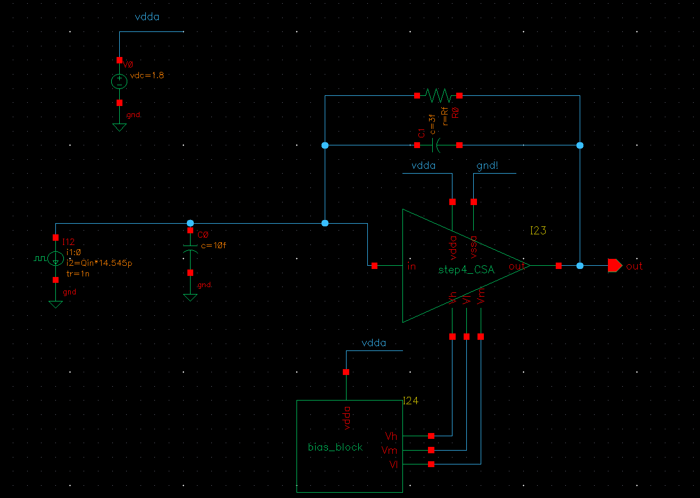

# Lab 06: Full CSA Simulation

---
## Schematic Creation

Now that the CSA core is designed with real transistors, test its behavior in the CSA configuration.

For this step, reuse the schematic of `step3_idealCSA_Rf`.

In the **Library Manager**, locate:

| Library            | Cell               | View      |
|--------------------|--------------------|-----------|
| MAPS_academy_lab   | step3_idealCSA_Rf  | schematic |

!!! rmb "On the **schematic** view, select **Copy**"

A **Copy View** window will appear. On the right side, enter:

| Library            | Cell               | View      |
|--------------------|--------------------|-----------|
| MAPS_academy_lab   | step5_tb_CSA_Rf    | schematic |

Click **OK** to close the window and copy the schematic.

Open the `step5_CSA_Rf` schematic. Select the `idealOpAMP` used previously and delete it:

!!! menu "Edit->Delete"
    ++del++

Also delete the `ground` symbol and its corresponding connection:

!!! lmb "Click and drag the mouse"
    to select and press ++del++.

Add the `CSA` designed in the previous step (`step4_CSA`). To complete the test bench, also add the `bias_block` instance and a `vdc` source to generate the `vdda` voltage.

With all elements in place, your schematic should resemble the following:

---
## Run Simulation

Create the **ADE Explorer** test bench. When the **ADE Explorer** window opens, import the test bench settings from a previous run:

!!! menu "Session->Import"

In the **Select View** section, choose:

| Library            | Cell               | View     |
|--------------------|--------------------|----------|
| MAPS_academy_lab   | step3_idealCSA_Rf  | maestro  |

Click **OK**.

This imports all the analyses, outputs, and expressions configured previously.

Run the simulation and wait for completion.
