# Layout of the CSA Amplifier

## Layout generation

This exercise will be different from the previous ones. You will do a layout of the charge sensitive amplifier and then we’ll do a simulation based on extracted layout.

Go to the `Library Manager` and find:

| Library           | Cell        |
|-------------------|-------------|
| MAPS_academy_lab  | step4_CSA   |

!!! rmb "Right click on the cell name `step4_CSA` and choose `Copy`"

In the right side of the `Copy Cell` window that appears put:

| `To Library`       | `Cell`            |
|--------------------|-------------------|
| MAPS_academy_lab   | step6_CSA_layout  |

Open the schematic of the newly created cell `step6_CSA_layout`. From the top menu select:

!!! menu "Launch->Layout XL"

Press `OK` in both windows that appear. Your screen should divide in two parts, a schematic on the left and layout on the right.

Before we do the next steps we have to make a change in the settings. In the layout window go to:

!!! menu "Options->Editor"

The `Layout Editor Options` window will appear. In the `Wire Editing` section change the `Default wire Constraing Group` to `LEFDefaultRouteSpec_fd_pr-main` (first from the list). Check the `Show Alignement Markers`tick box and close the option window by clicking `OK`.

Then, still in the `Virtuoso Studio Layout Suite` go to

!!! menu "Connectivity->Generate->All From Source"

A `Generate Layout` window will appear. In the `Generate` section uncheck the `PR Boundary` and press `OK`.

This will generate four transistors and 7 pins, as in the following figure. If you don’t see the transistors as in the below picture use ++shift+f++ to enable the layout view.

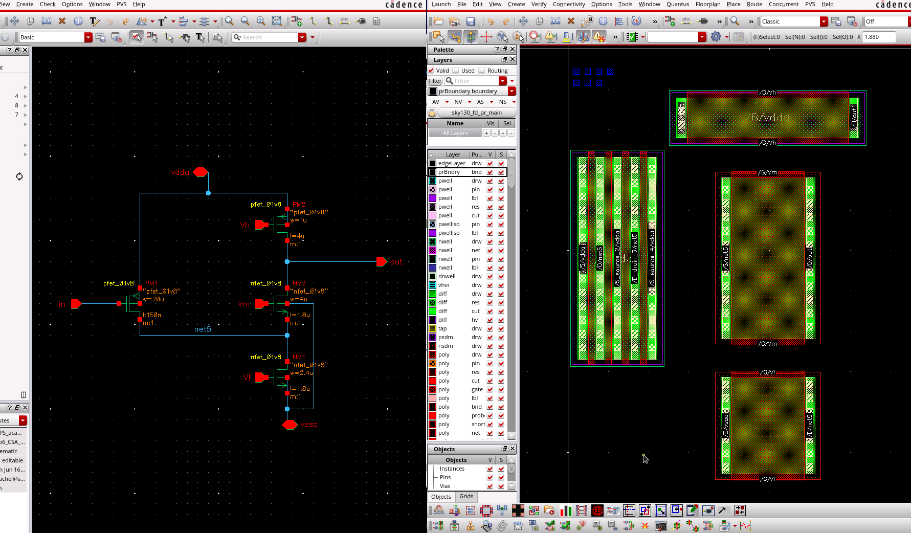

Notice that when you select the transistor on the layout (by clicking on it) it will be selected also in the schematic.

Select the transistors one by one and for each perform the following: press ++q++ to open the `Instance Properties` window. In this window you should change two settings:

- Set the `Gate Connection` to `Top` for all transistors except the input (PM1) to `Bottom`. This will generate the contacts for the gates of the transistors.
- Enable `M1/Mcon on S/D` to have metal contacts on the source and drain of transistors.
- Select `Right Tap` for `NMOS` transistors, and `Top Tap` for the `PMOS` transistors.

Then select the input PMOS transistor (PM1) and change another property: In the `S/D Connection` section select `Both`. As the input transistor is long and narrow (big `W/L`) it is divided into 4 parallel fingers. Selecting this option will make the internal connections.

After changing the transistors parameters, you should have a layout similar to this one:

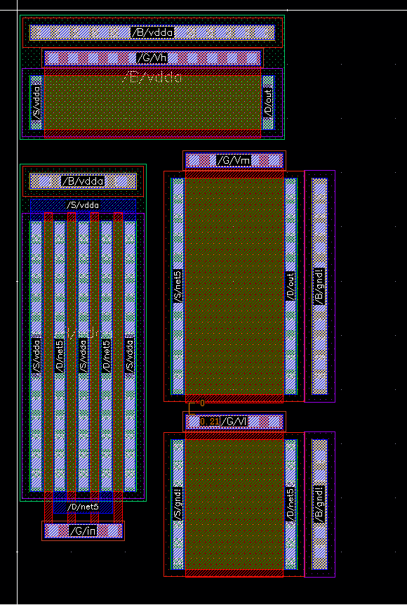

For simpler routing we will exchange the source and drain of the `NM1` transistor (the one with its gate connected to the `Vl`). Select it in the layout window and press `q`, then click on `Switch S/D`.

## NWELL connection

Now let’s start the routing with drawing the NWELL that will connect the both NWELLs (of transistors `PM1` and `PM2`). In the `Layers` window on the left, select the `nwell drw` layer.

Clicking and holding the right mouse button zoom to the area where the two NWELLs will connect as in the following picture:

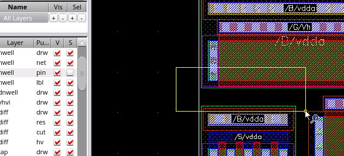

Then use the mouse wheel to zoom-in to the corner of the NWELL.

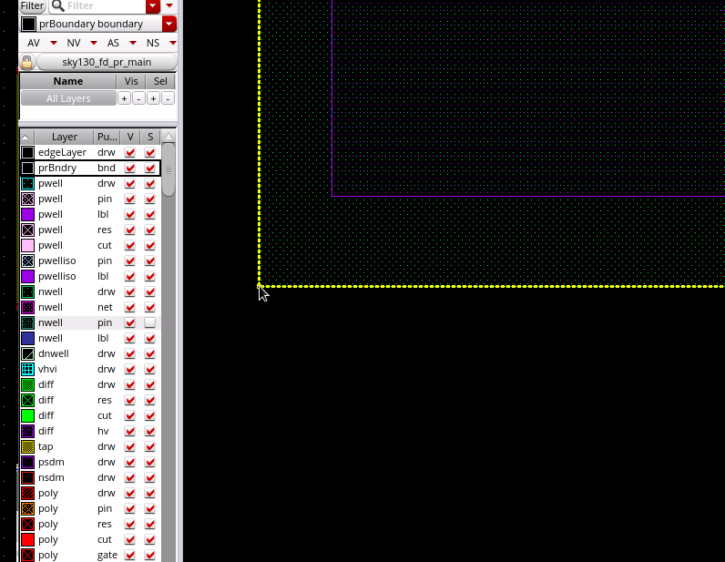

While your mouse points at the corner of the NWELL (green area with dots) and the `nwell drw` layer is selected press ++r++ and click the ++left-button++. Zoom out with the mouse wheel and draw a rectangle that will connect both NWELLs. While drawing you an also zoom in with the mouse wheel to place the rectangle precisely. When you’re satisfied with your rectangle press left mouse button to place it and ++esc++ key.

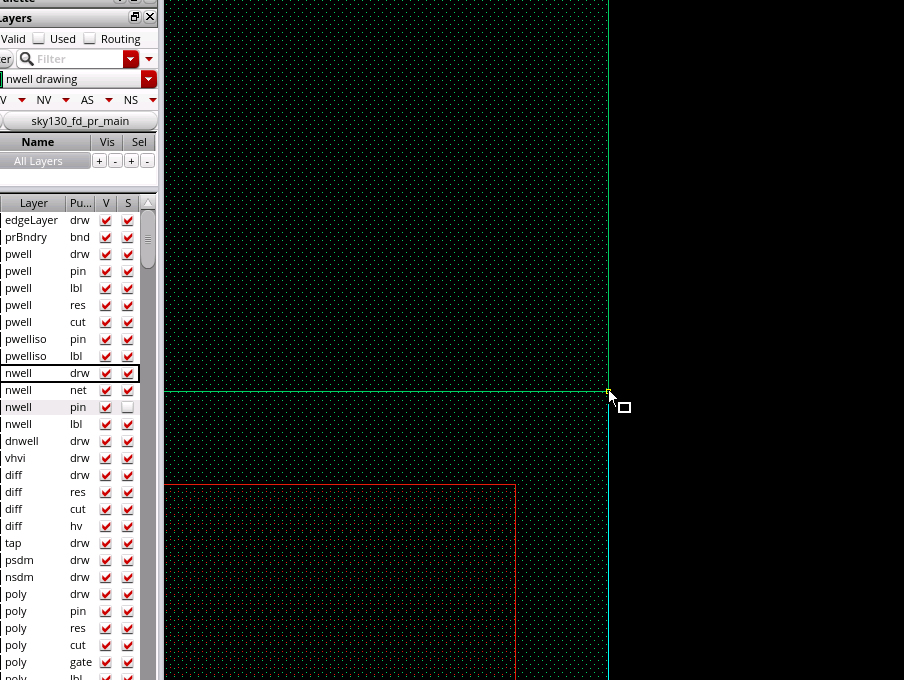

If you want to undo the changes, press ++u++, and ++shift+u++ to redo.

Before doing the next step, make sure that you are in the `partial select mode`. In the middle of the `Virtuoso Studio Layout` window you can see the following section:  

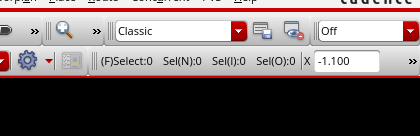

In this case the `(F)Select` means that we are in a `full select mode`, press ++f4++ to change it to `(P)Select` for `partial select mode`.

If your rectangle is too small or too big as in the following picture, hover your mouse over the edge of the rectangle and select it when highlighted. Press ++s++ and click ++left-button++, now you can stretch the rectangle to the correct size.

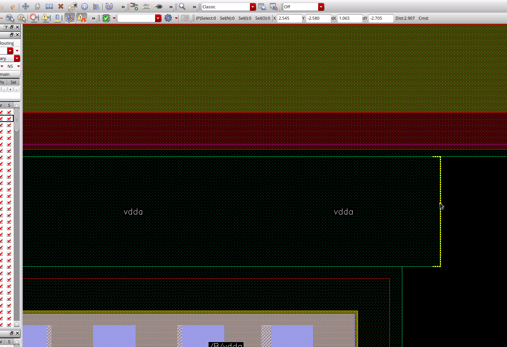

## Metal routing

### vssa net

Next step is to connect electrically the metal layers. Let’s start with the `vssa` node connections. Press ++f++ to zoom-out to the full layout and then zoom in by pressing ++right-button++ and drawing a rectangle on the right side of the layout.

From the Layers list choose `met1 drw`, place your mouse over the `vssa` metal line and press ++p++ (or ++shift+ctrl+w++) to create a wire. Your cursor will change shape and a `met 1 (0.27)`.

This means that if you place a wire here it will automatically have the width of 0.27µm which corresponds to the metal layer width of the `vssa` contacts. Place a wire connecting the substrates of both NMOS transistors.

Then draw a rectangle to connect the source of the transistor NM1 to these substrate contacts. You can also use a wire to connect the source and the substrate contacts. In wire mode put the mouse cursor close to the long edge of the source or the substrate contacts. The cursor will change to `met1 (2.4)`, then click on connect to the other part.

The `vssa` node is routed.

### net5 net

Now let’s connected the `net5` connecting the input transistor `PM1` with the `NM1` and `NM2`. Zoom in to the area where the `net5` is.

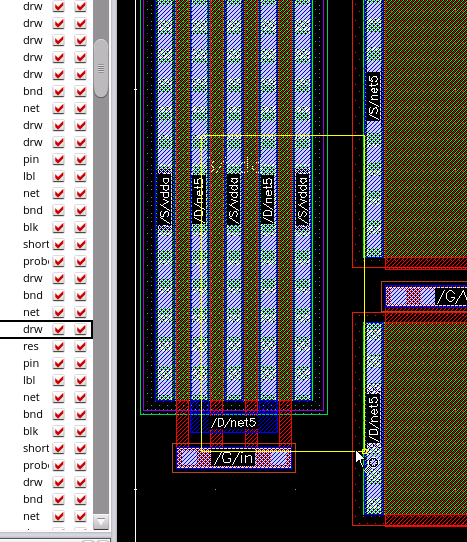

Hover your mouse over the `net5` coming from the `PM1` transistor, press ++p++ to connect this line to the `NM1` drain. Then draw another line coming from the `NM2` transistor that goes down to the `net5` line you’ve drawn before:

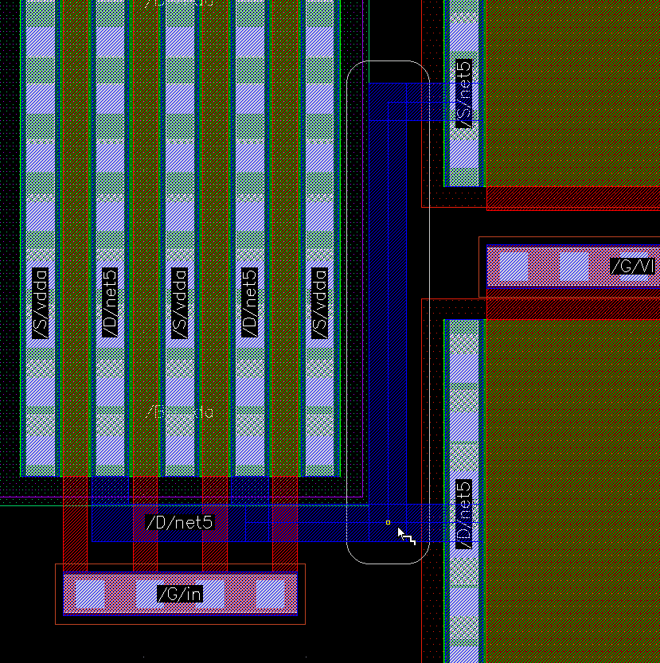

Make sure that you are not breaking the `metal1-metal1` spacing design rule. The two paths drawn with `metal1` layer should be separated by at least 0.14µm.

To verify this, zoom in to the place you’re concerned about press ++k++ and select both edges of metal paths. This will draw a ruler between the metal paths giving you the distance. (If you want to remove all the rulers press ++shift+k++). If the path is too close, you can use the `stretch` tool again. Press ++ctrl+d++ to deselect all the selected elements and press ++s++ and click on the path you want to stretch.

### vdda net

Now interconnect all the metal nets on the `vdda` node. You can do it by drawing a single line going up from the `PM1` transistor. Be sure, however to keep the 0.14µm distance from the Vh metal layer on the `PM2`.

### out net

To finish the routing, connect the output node `out` to the drain of the `NM2` and to the drain of the `PM2`.

## Placing pins and labels

Finally, let’s focus on those small rectangles that we have generated. Select the pins one by one and move them (press ++m++ and ++left-button++ click) to their destination (on the metal paths). The Layout tool should display a guide line.

When the pins are placed, in the last step, add the labels on each pin.

!!! menu "Option->Display"
    ++e++

In `Display control`, enable `pin names` to see them. Now choose the `met1 lbl` (or `met1 label`) layer.

!!! menu "Create-> Label"
    ++l++

Put in the pin name and place the label on the pin. (The small cross in the middle of the label has to be placed on the pin).

When placing the name a helper pop-up may appear asking on which object the label should be placed, choose `met1 drawing rect`.

We can also choose the font size in the proprieties of the label (select the label and press ++q++).

!!! warning
    Warning the label cross has to be placed on the metal pin in order for the verification tools to work correctly.

## Performing the Layout vs Schematic

We will now verify if your layout matches the schematic. In the `Virtuoso Studio Layout` go to:

!!! menu "PVS->Run LVS"

The following window will appear.

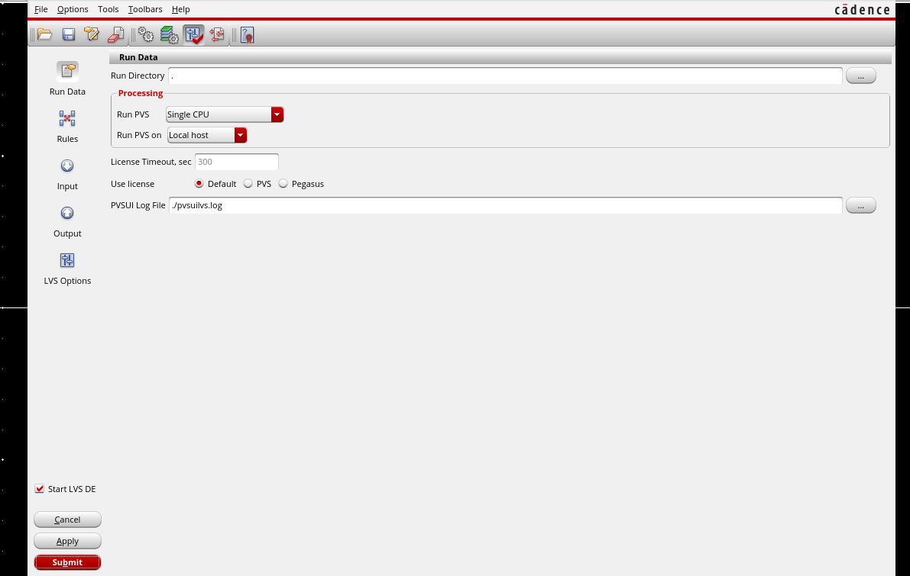

Go to `Rules` pane and select the technology `sky130` like below.

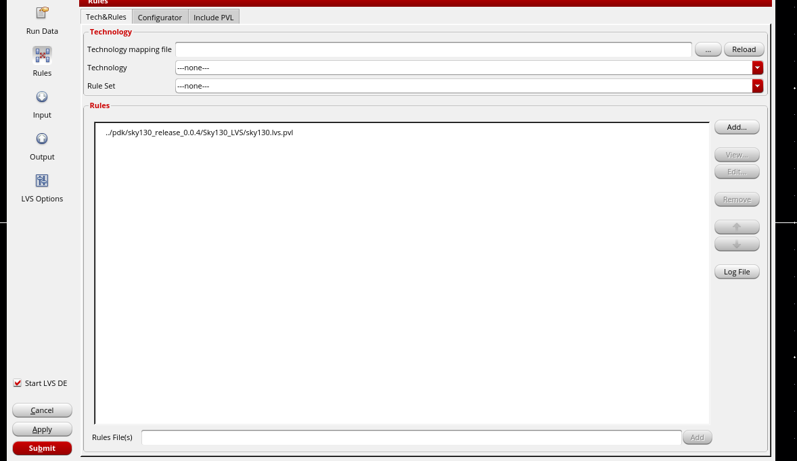

To run the LVS comparison, press the red `Submit` button. If your layout is correctly connected you should see the following window. If not, check the errors (press `Yes` to see the debug window) and try to fix them redoing the instructions.

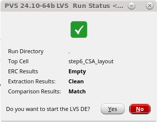

## Performing the Design Rule Check

An important step before sending the circuit to production is to verify if your design does not break any rules. In the `Virtuoso Studio Layout` go to:

!!! menu "PVS->Run DRC"

Go to `Rules` section and select the technology `sky130` like before. In the tab `Configurator`, select `Turn off inaccurate rules` and `No density`. Then, press `Submit`.

If you’ll get any errors in the `PVS DRC Results` window, correct them and press `ReRun` in the `PVS Reports` window. If the `PVS DRC Results` window is empty, great job you have finished your first layout.

## Extract the parasitics for a post-layout simulation

When the LVS and DRC were done without errors perform the extraction of parasitics. In the `Virtuoso Studio Layout` go to:

!!! menu "Quantus->Run PVS Quantus"

Press `OK` button in the next window that appears to confirm that we want to extract the step6_CSA_layout cell.

In the `Quantus (PVS) Parasitic Extraction Run Form` window:

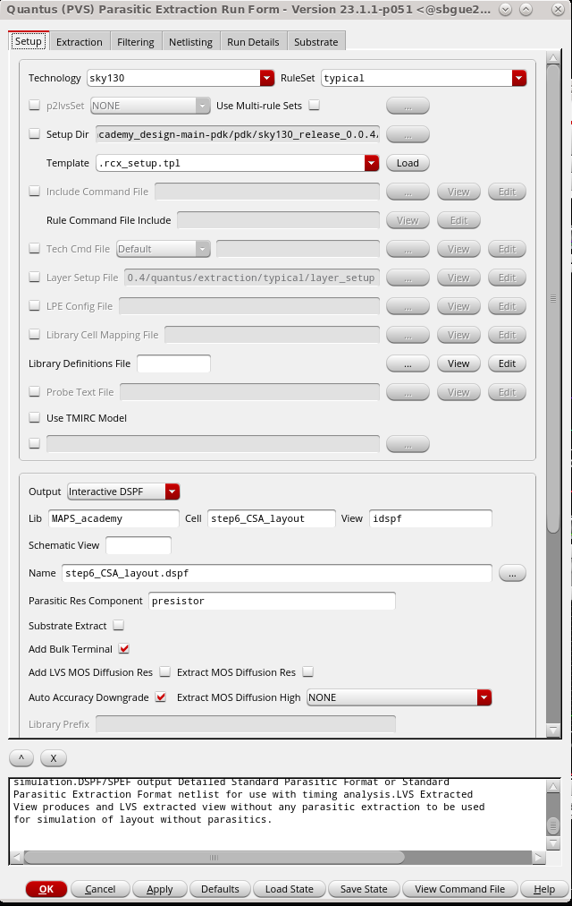

In the `Setup` tab, go to Output and choose `Interactive DSPF`, go to Extraction tab and make sure that the `Extraction Type` is `C only` and `Ref Node` is set to: `gnd!`.

Press `OK` to start the extraction. In a few moments a small window should appear informing you that the extraction is finished.

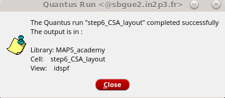

## Simulation with parasitics extracted from the layout

Close all the schematic and layout Virtuoso windows.

Go to the `library Manager` and find:

| Library           | Cell             | View      |
|-------------------|------------------|-----------|
| MAPS_academy_lab  | step5_tb_CSA_Rf  | schematic |

Right click on the schematic `View` and select `Copy`. A `Copy View` window will appear. In the right side choose:

| Library           | Cell               | View      |
|-------------------|--------------------|-----------|
| MAPS_academy_lab  | step7_tb_CSA_extr  | schematic |

Click `OK` to close the window and copy the schematic.

Go to the `step7_tb_CSA_extr` schematic and open it. Select the `CSA` that we used before and delete it with:

!!! menu "Edit->Delete"
    ++del++

Add the symbol of the cell `step6_CSA_layout` you have designed in the previous step. Connect all the signals (`vssa` connects directly to `gnd` symbol or a node labeled `gnd!`).

Create the `ADE Explorer` testbench. When the `ADE Explorer` window open, import the testbench settings from a previous run.

!!! menu "Session->Import"

In the `Select View` section choose:

| Library           | Cell             | View     |
|-------------------|------------------|----------|
| MAPS_academy_lab  | step5_tb_CSA_Rf  | maestro  |

Now we will add the information from the extraction. In the `Virtuoso ADE Explorer`, go to:

!!! menu "Setup->Simulation Files"

In the `Paths/Files` tab select (tick) the `Parasitic Files (dspf)` and double click to add the file: `step6_CSA_layout.dspf` should appear in the list of files.

Confirm the file selected by pressing `Open and close the Simulation files Setup` by pressing `OK`.

Run the simulation and wait for it to complete. You can observe slight differences from the previous simulation corresponding to the parasitic capacitors in the in the layout.

## Explore your design in 3D

Follow the link [https://gds-viewer.tinytapeout.com](https://gds-viewer.tinytapeout.com) and upload the GDS file.

A GDS file was generated during the LVS step under the `pvs_lvs` with the name `step6_CSA_layout.gds`.
