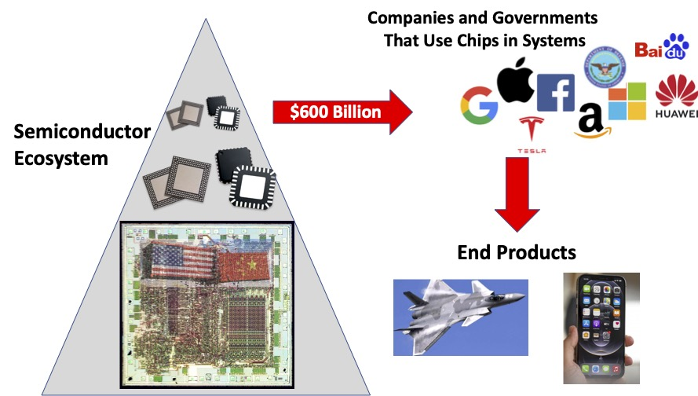
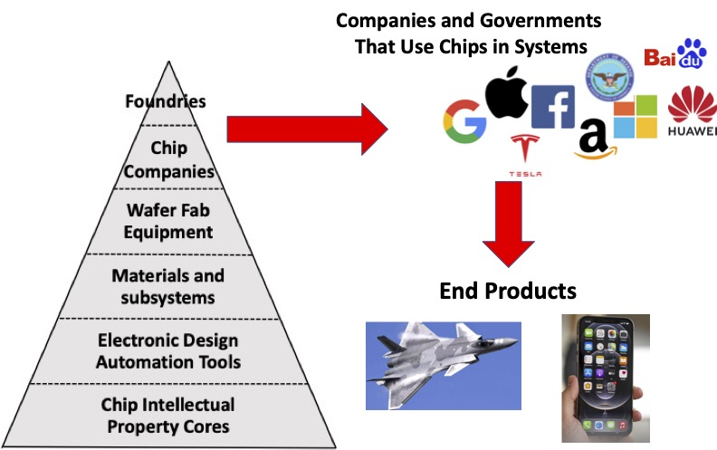
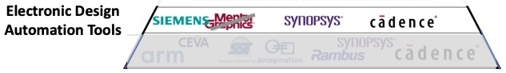
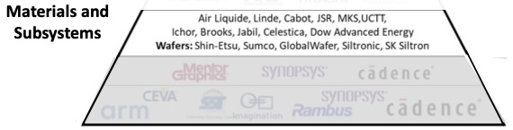

<!-- .slide: data-background-color="#003366" -->

# Semiconductor ecosystem

in brief

---

## Ecosystem

---

## Industry

---

## Chip Intellectual Property (IP) Cores

 <!-- .element height="150%" width="150%" -->

---

## Electronic Design Automation (EDA) Tools

 <!-- .element height="150%" width="150%" -->

---

## Specialized Materials and Chemicals

 <!-- .element height="150%" width="150%" -->
