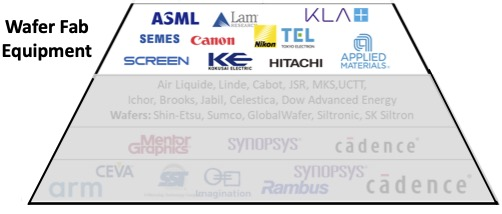
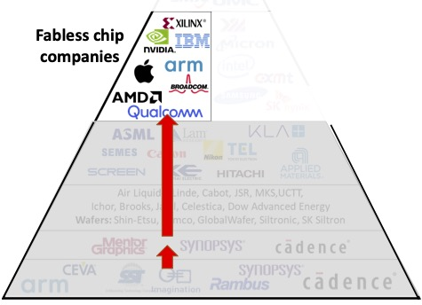
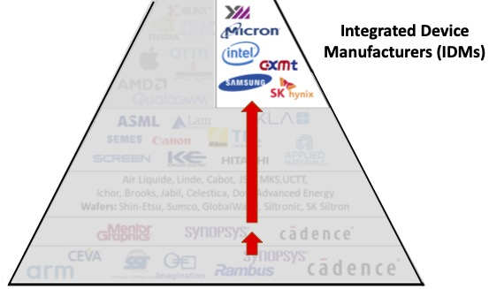
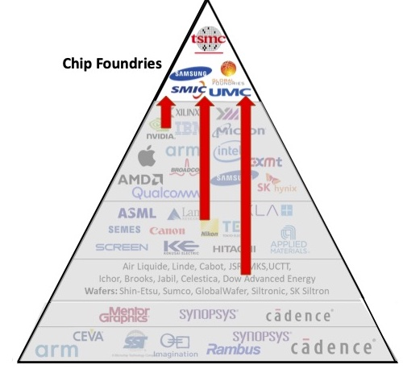
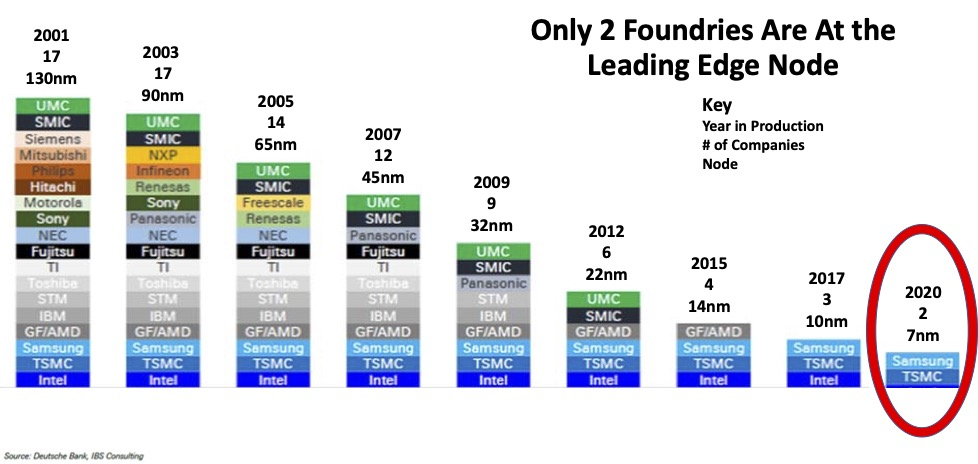

<!-- .slide: data-background-color="#003366" -->

# Semiconductor ecosystem

in brief

---

## Ecosystem

---

## Industry

---

## Chip Intellectual Property (IP) Cores

 <!-- .element height="100%" width="100%" -->

---

## Electronic Design Automation (EDA) Tools

 <!-- .element height="100%" width="100%" -->

---

## Specialized Materials and Chemicals

 <!-- .element height="100%" width="100%" -->

---

## Wafer Fab Equipment

 <!-- .element height="100%" width="100%" -->

---

## Fabless chip companies

 <!-- .element height="100%" width="100%" -->

---

## Integrated Device Manufacturers

 <!-- .element height="100%" width="100%" -->

---

## Chip Foundries

 <!-- .element height="80%" width="80%" -->

---

## Nodes and Foundries

