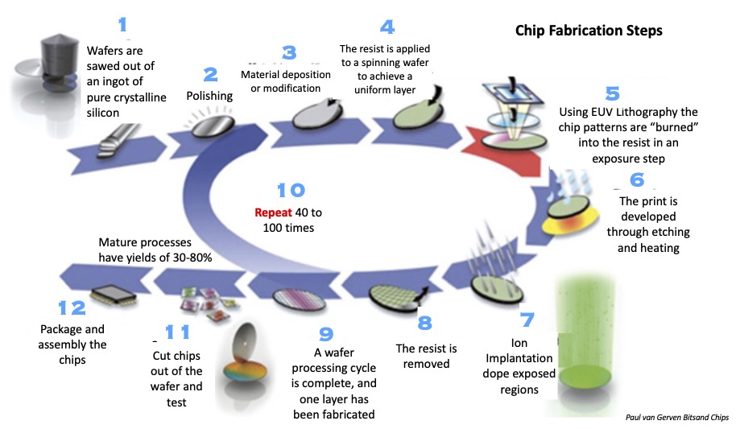

<!-- .slide: data-background-color="#003366" -->

# CMOS process fabrication

---

## Grow field oxide

<svg viewBox="0 15 200 50" width="90%" height="90%">
    <image href="../images/cmos_process_fab.svg"/>
</svg>

--

## Etch oxide for pMOSFET

<svg viewBox="0 80 200 50" width="90%" height="90%">
    <image href="../images/cmos_process_fab.svg"/>
</svg>

--

## Diffuse n-well

<svg viewBox="0 145 200 50" width="90%" height="90%">
    <image href="../images/cmos_process_fab.svg"/>
</svg>

--

## Etch oxide for nMOSFET

<svg viewBox="0 210 200 50" width="90%" height="90%">
    <image href="../images/cmos_process_fab.svg"/>
</svg>

--

## Grow gate oxide

<svg viewBox="0 276 200 50" width="90%" height="90%">
    <image href="../images/cmos_process_fab.svg"/>
</svg>

--

## Deposit polysilicon

<svg viewBox="0 345 200 50" width="90%" height="90%">
    <image href="../images/cmos_process_fab.svg"/>
</svg>

--

## Etch polysilicon and oxide

<svg viewBox="0 420 200 50" width="90%" height="90%">
    <image href="../images/cmos_process_fab.svg"/>
</svg>

--

## Implant sources and drains

<svg viewBox="0 490 200 50" width="90%" height="90%">
    <image href="../images/cmos_process_fab.svg"/>
</svg>

--

## Grow nitride

<svg viewBox="0 558 200 55" width="90%" height="90%">
    <image href="../images/cmos_process_fab.svg"/>
</svg>

--

## Etch nitride

<svg viewBox="0 633 200 55" width="90%" height="90%">
    <image href="../images/cmos_process_fab.svg"/>
</svg>

--

## Deposit metal

<svg viewBox="0 710 200 58" width="90%" height="90%">
    <image href="../images/cmos_process_fab.svg"/>
</svg>

--

## Etch metal

<svg viewBox="0 790 200 58" width="90%" height="90%">
    <image href="../images/cmos_process_fab.svg"/>
</svg>

--

## Reference

[https://en.wikipedia.org/wiki/Wafer_fabrication](https://en.wikipedia.org/wiki/Wafer_fabrication)

---

## SkyWater 130 nm Stack diagram

<!-- .element height="70%" width="70%" -->

---

## Chip Fabrication steps

---

## Additional ressources

- How are Microchips Made?
    - [https://youtu.be/dX9CGRZwD-w](https://youtu.be/dX9CGRZwD-w)<!-- .element target="_blank" rel="noopener noreferrer" -->
- 3D layout view
    - [Exemple](https://gds-viewer.tinytapeout.com/?model=https%3A%2F%2Fshuttle-assets.tinytapeout.com%2Ftt09%2Ftt_um_MichaelBell_hd_8b10b%2Ftt_um_MichaelBell_hd_8b10b.gds&process=SKY130)<!-- .element target="_blank" rel="noopener noreferrer" -->
    - Try your own [design](https://gds-viewer.tinytapeout.com)<!-- .element target="_blank" rel="noopener noreferrer" -->
- Basic exemples:
    - [https://app.siliwiz.com](https://app.siliwiz.com)<!-- .element target="_blank" rel="noopener noreferrer" -->
